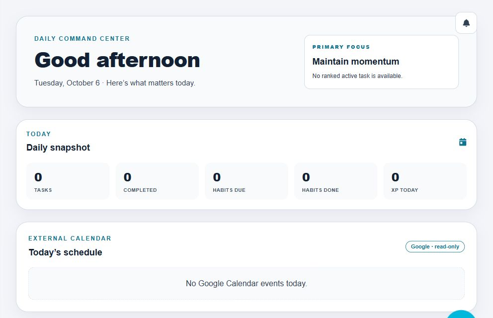

# Nihal Arfain Ahmed

**Aspiring Robotics + AI Engineer**

Building intelligent systems that connect software reasoning with real-world action.

Robotics · Artificial Intelligence · Embedded Systems · Intelligent Agents

## About

I'm preparing for undergraduate study in robotics and AI, learning by building systems that have to work beyond a tutorial. My projects connect two interests: human-centered software that helps people act intentionally, and embedded hardware that senses and moves in the physical world.

My long-term direction is intelligent robotic systems—with reliable control, understandable reasoning, and clear boundaries around what automation is allowed to do.

## Flagship projects

### [LifeOS](https://github.com/Nihal786007/LifeOS)

*A personal operating system for planning, execution, focus, reflection, and permissioned intelligent actions.*

**Problem:** Plans, daily work, and reflection often live in disconnected tools.

**What I'm building:** A connected workflow from Life Goals → Monthly Outcomes → Weekly Focus → Tasks, supported by a Daily Command Center, Habits, Analytics, Reviews, and timestamp-correct Focus Mode. Reality Mirror compares intended priorities with recorded attention rather than treating completed checkboxes as the whole picture.

**Engineering depth:**

- Canonical domain ownership, trusted execution engines, and account-scoped repositories.
- Supabase Auth/RLS and per-user PowerSync databases, with offline/reconnect and explicit adoption/recovery boundaries.
- Deterministic ATLAS Fact Core and validated citations; Memory remains non-citable context.
- Action + Permission Engine: strict candidate validation → proposal → explicit approval → trusted execution.
- Google Calendar reads and exact-payload-approved event creation, separate from LifeOS Tasks.
- Deterministic regression tests, separate Node/browser typechecking, and Light / Dark / System appearance.

**Status:** Working web application under active development. Hosted AI adapters are being evaluated; no production provider has been selected.

**Tech:** TypeScript · React · Vite · Tailwind CSS · Supabase · PowerSync · OAuth

[Explore the repository](https://github.com/Nihal786007/LifeOS)

See LifeOS — Daily Command Center and Reality Mirror

Real light-mode screenshots of an empty workspace. No personal account details, fabricated activity, or model-generated results are shown.

### [APEX](https://github.com/Nihal786007/Apex)

*A ground-up robotics platform focused on sensing, movement, embedded control, and future autonomous behavior.*

**Problem:** Understanding robotics requires integrating firmware, electronics, power, and physical behavior—not just running code.

**What I'm building:** An ESP32-based platform through iterative wiring, firmware, and hardware tests. Documented progress includes ESP32 bring-up, the first blink test, serial-driver troubleshooting, and motor-driver/movement testing.

**Hardware direction:** ESP32 DevKit, TB6612FNG, four TT motors, HC-SR04, IR sensors, MG90S servo, OLED, and custom power distribution using an LM2596. This describes the build direction, not a claim that every subsystem is integrated.

**Status:** Early hardware/embedded development. Autonomous navigation, vision, and AI control remain future work.

**Tech:** ESP32 · C/C++ · Arduino IDE · Electronics · Git

[Explore the repository](https://github.com/Nihal786007/Apex) · [Read the first engineering log](https://github.com/Nihal786007/Apex/blob/main/progress/Session_01_ESP32_First_Blink/Session_01_Notes.md)

## Current focus

- Developing LifeOS while preserving its data, evidence, and approval boundaries.
- Building APEX through small, documented hardware and firmware experiments.
- Strengthening foundations in robotics, AI, embedded programming, and control.
- Preparing for undergraduate study in Robotics / AI.

## Engineering interests

Robotics · Artificial Intelligence · Embedded Systems · Autonomous Systems

Intelligent Agents · Human–Computer Interaction · Computer Vision · Control Systems

These are areas I'm working toward, not claims of mastery.

## Technical toolkit

| Area | Tools and experience |
| --- | --- |
| Application engineering | TypeScript, React, Vite, Tailwind CSS |
| Data and integration | Supabase, PowerSync, REST APIs, OAuth |
| Embedded development | C/C++, ESP32, Arduino IDE, electronics and hardware troubleshooting |
| Development practice | Git/GitHub, deterministic tests, typed boundaries, iterative debugging |

I'm also strengthening Python alongside robotics and AI fundamentals.

## Engineering principles

- Architecture before shortcuts.
- Test before trust.
- Keep automated reasoning explainable and grounded.
- Require explicit approval for consequential actions.
- Build → test → learn → improve.

## Selected GitHub work

[LifeOS — software, intelligence, and systems](https://github.com/Nihal786007/LifeOS)

[APEX — embedded development and robotics](https://github.com/Nihal786007/Apex)

## Connect

Find my projects and reach out through [GitHub](https://github.com/Nihal786007).
